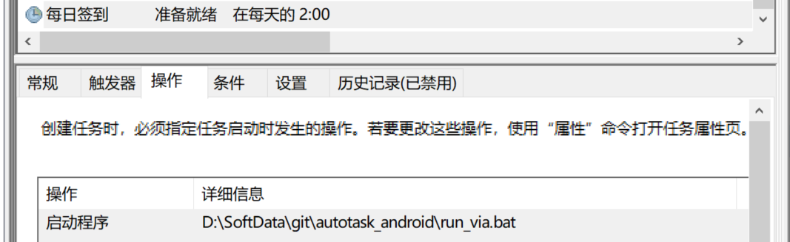

## 基于via浏览器的签到
### 条件
* 分辨率`960x540`,dpi`160`
* via浏览器 开启桌面模式
* 自己登录网页并收藏网页到主页

### 文件说明
* `run_via.bat` 执行所有脚本
* * 存在`via_tag.txt`才会执行`via_tag.py`中的脚本
* `via_ablesci`, [科研通](https://www.ablesci.com/)每日签到
* `via_muchong`, [小木虫](https://muchong.com/bbs/)每日签到


### windows计划运行实例
配置文件
```
[client]
mynode = 2
LINK_dict = {
    2: "Android:///127.0.0.1:16448"}
[control]
figdir=assets
logfile={
    2: "result.2.txt"}
```
计划任务设置
